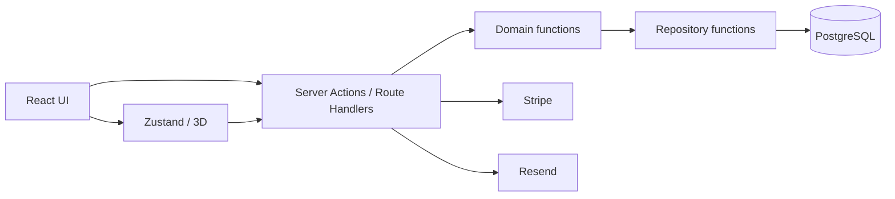

# 技術スタックと責務

## バージョン方針

具体的なバージョンは実装時の`package.json`とlockfileを正典とし、この文書では固定しない。Node.jsは採用時点のLTSを使用し、全員で同じメジャーバージョンへ揃える。

## 採用技術

| 領域 | 技術 | 主な責務 | 採用理由 |
|---|---|---|---|
| 言語 | TypeScript | 画面・サーバー・共通型 | 4人が同じデータ契約を共有する |
| Web | Next.js App Router | 画面、Server Actions、Route Handlers | フロントとAPIを1リポジトリにまとめる |
| UI | React / Tailwind CSS / shadcn/ui | 買い手・店舗画面 | 画面骨組みと共通部品を短期間で作る |
| フォーム | react-hook-form / Zod | 入力状態と検証 | クライアントとサーバーで同じ制約を使う |
| クライアント状態 | Zustand | カスタマイズ中の色・配置・価格 | 3Dと通常UIの状態共有 |
| 3D | Three.js / React Three Fiber / drei | GLB表示、カメラ、配置 | React画面へ3D操作を統合する |
| モデリング | Blender / GLB | 5号土台と飾り | Web用の軽量モデルを自作する |
| DB | PostgreSQL（Neon） | 業務データと履歴 | トランザクション、行ロック、制約 |
| ORM | Prisma | スキーマ、migration、DBアクセス | TypeScript型とDBを接続する |
| 決済 | Stripeテストモード | PaymentIntent、Webhook、返金 | 決済ライフサイクルを検証する |
| メール | Resend | 注文・受取可・返金通知 | 送信結果をDBで追跡する |
| 日付 | date-fns / date-fns-tz | UTC保存とJST業務判定 | 日付境界処理を共通化する |
| テスト | Vitest | 純粋関数・DBロジック | 価格、税、返金、予約枠を再現可能にする |
| 配備 | Vercel | Previewと公開環境 | PRごとの確認とNext.js実行 |
| 図・印刷 | SVG / CSS print | 俯瞰図・A4指示書 | 3D非対応時も厨房資料を生成できる |

## レイヤー責務

- UIはDBへ直接アクセスしない。
- Domain関数は可能な限り純粋関数にし、価格・返金・日付判定を外部APIから分離する。
- Repository関数だけがPrismaへ依存する。
- Stripe・Resendの結果は必ずDBログへ残す。
- 3Dと俯瞰SVGは同じPlacement型を使う。

## 環境

| 環境 | 用途 | DB | 決済 |
|---|---|---|---|
| Local | 個人開発 | ローカルまたは開発DB | Stripe test |
| Preview | PRレビュー | Preview専用DB | Stripe test |
| Production | HEW公開候補 | Production専用DB | 原則デモモード。実決済は行わない |

PreviewとProductionでDBを共有しない。環境変数の値はGitへ保存せず、Codexは`.env`系ファイルを編集しない。

## 追加ライブラリ判断

新しい依存関係を追加する前に以下を確認する。

1. 標準APIまたは既存依存で実現できないか。
2. どのIssueの完了条件に必要か。
3. バンドルサイズ、学習時間、保守負担は許容できるか。
4. チームが`package.json`変更を承認したか。

画像印刷関連のストレージ・画像処理ライブラリは、#69の採用判断まで追加しない。
