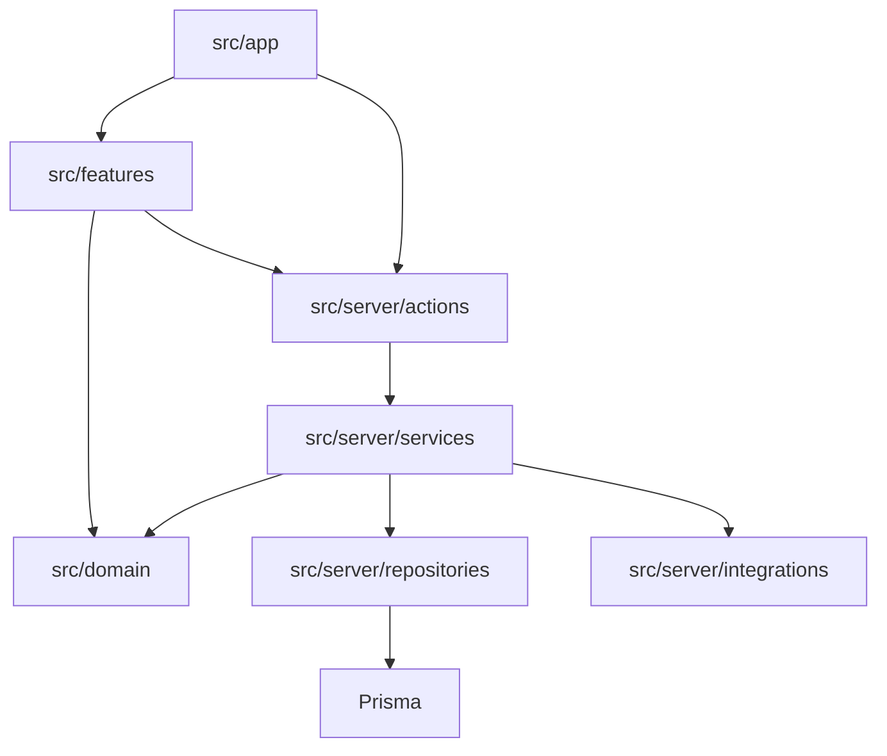

# ファイル構造と依存方向

## 推奨構成

```text
.
├─ docs/
│  └─ issue-reference/          # Issue実装の共通設計資料
├─ plan/                        # 企画・決定・進捗
├─ prisma/
│  ├─ schema.prisma
│  ├─ migrations/
│  └─ seed.ts
├─ public/
│  └─ models/                   # 5号土台・飾りのGLB
├─ src/
│  ├─ app/
│  │  ├─ (buyer)/
│  │  │  └─ stores/[storeSlug]/
│  │  │     ├─ page.tsx
│  │  │     ├─ customize/page.tsx
│  │  │     ├─ checkout/page.tsx
│  │  │     ├─ complete/page.tsx
│  │  │     └─ orders/[orderNo]/page.tsx
│  │  ├─ store-admin/
│  │  │  ├─ login/page.tsx
│  │  │  ├─ orders/page.tsx
│  │  │  ├─ orders/[id]/page.tsx
│  │  │  ├─ capacity/page.tsx
│  │  │  └─ parts/page.tsx
│  │  ├─ share/[shareId]/page.tsx
│  │  └─ api/
│  │     ├─ stripe/webhook/route.ts
│  │     └─ cron/cleanup/route.ts
│  ├─ features/
│  │  ├─ customization/         # 色、飾り、メッセージ
│  │  ├─ editor-3d/             # R3Fシーンと配置操作
│  │  ├─ overview-svg/          # 俯瞰図
│  │  ├─ checkout/              # ゲスト入力と決済UI
│  │  ├─ order-lookup/          # 秘密リンク照会
│  │  ├─ store-orders/          # 店舗注文管理
│  │  ├─ capacity/              # 予約枠UI
│  │  └─ instruction-sheet/     # 印刷指示書
│  ├─ domain/
│  │  ├─ types.ts
│  │  ├─ schemas.ts
│  │  ├─ pricing.ts
│  │  ├─ refund-policy.ts
│  │  ├─ capacity-policy.ts
│  │  └─ datetime.ts
│  ├─ server/
│  │  ├─ actions/
│  │  ├─ repositories/
│  │  ├─ services/
│  │  ├─ auth/
│  │  ├─ db/
│  │  └─ integrations/
│  │     ├─ stripe.ts
│  │     └─ resend.ts
│  ├─ components/ui/            # shadcn/uiと全体共通UI
│  └─ test/
│     ├─ fixtures/
│     └─ helpers/
└─ README.md
```

## 配置ルール

- `src/app`: URL、ページ組み立て、Route Handler。重い業務ロジックを置かない。
- `src/features`: 画面機能単位。別機能の内部ファイルへ直接依存しない。
- `src/domain`: DB・React・Stripeに依存しない型と純粋ロジック。
- `src/server/actions`: UIから呼ぶサーバー処理。認可・入力検証・トランザクション開始を担当。
- `src/server/repositories`: Prismaによる読取・書込。
- `src/server/services`: 複数Repositoryや外部サービスを束ねるユースケース。
- `src/server/integrations`: Stripe・Resend固有処理を閉じ込める。
- `public/models`: 由来・ライセンスを記録できる自作または許諾済みGLBのみ。

## 依存方向



逆向き依存は禁止する。特に`src/domain`からReact、Prisma、Stripeをimportしない。

## 命名

- Reactコンポーネント: `PascalCase.tsx`
- 関数・非コンポーネント: `kebab-case.ts`
- Zodスキーマ: `xxxSchema`
- Prismaモデル: 単数`PascalCase`
- DB列・TypeScript値: `camelCase`
- boolean: `isDemo`、`isClosed`のように意味が分かる接頭辞を使う
- 日時: `createdAt`、`lockedAt`、`expiresAt`

## Issueごとの変更範囲

1つのIssueで複数レイヤーを変更してよいが、関係のない機能まで同じPRへ含めない。DBスキーマ変更を伴う場合は、migration、型、影響資料を同じPRで更新する。
