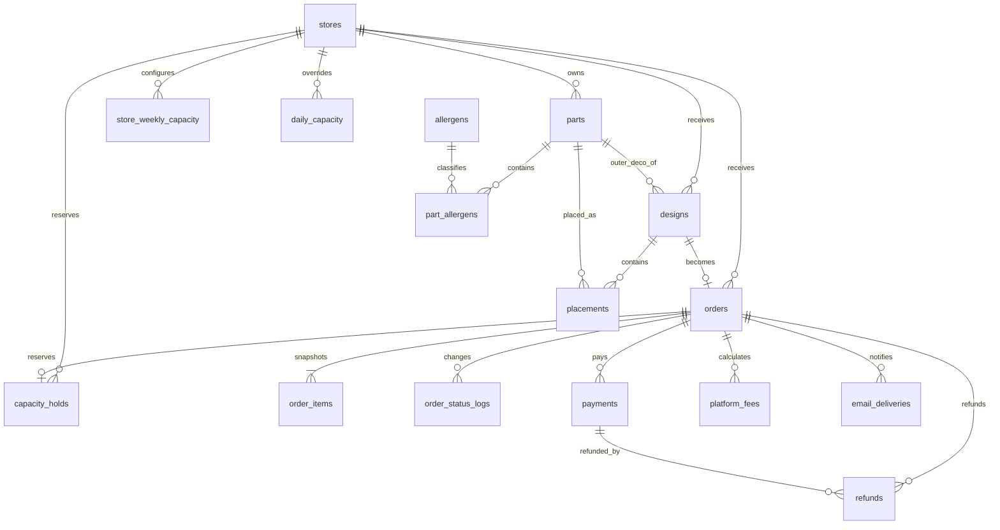
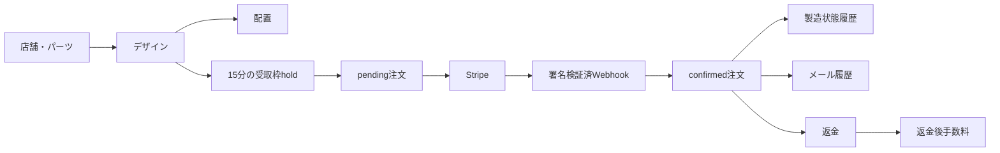

# ER 図

列・制約の詳細は [04-database-design.md](./04-database-design.md) を参照する。

## 主な属性

```mermaid
erDiagram
    stores {
      string id PK
      string slug UK
      string code UK
      string name
    }
    parts {
      string id PK
      string store_id FK
      enum category
      string name
      string asset_key
      int unit_price
    }
    allergens {
      string id PK
      string code UK
      string name
    }
    part_allergens {
      string part_id PK,FK
      string allergen_id PK,FK
    }
    designs {
      string id PK
      string store_id FK
      string outer_deco_part_id FK
      string sponge_color
      string cream_color
      string message_text
      int version
      datetime locked_at
    }
    placements {
      string id PK
      string design_id FK
      string part_id FK
      int seq_no
      float position_x
      float position_y
      float position_z
      float rotation_x
      float rotation_y
      float rotation_z
      float scale
    }
    orders {
      string id PK
      string store_id FK
      string design_id FK,UK
      date pickup_date
      int pickup_sequence
      string status
      int subtotal
      int tax
      int total
      string access_token_hash UK
    }
    order_items {
      string id PK
      string order_id FK
      string name_snapshot
      int unit_price
      int quantity
      int line_total
    }
    order_status_logs {
      string id PK
      string order_id FK
      string from_status
      string to_status
      string actor_type
      datetime created_at
    }
    store_weekly_capacity {
      string id PK
      string store_id FK
      int weekday
      int capacity_points
    }
    daily_capacity {
      string id PK
      string store_id FK
      date pickup_date
      int capacity_points
      boolean is_closed
    }
    capacity_holds {
      string id PK
      string store_id FK
      string design_id FK
      string order_id FK,UK
      date pickup_date
      int points
      string status
      datetime expires_at
    }
    payments {
      string id PK
      string order_id FK
      string payment_intent_id UK
      string status
      int amount
    }
    webhook_events {
      string id PK
      string provider
      string event_id UK
      string status
      datetime processed_at
    }
    refunds {
      string id PK
      string order_id FK
      string payment_id FK
      string provider_refund_id UK
      string idempotency_key UK
      int amount
    }
    platform_fees {
      string id PK
      string order_id FK
      int basis_amount
      int amount
    }
    email_deliveries {
      string id PK
      string order_id FK
      string dedupe_key UK
      string status
    }
    rate_limits {
      string id PK
      string key_hash
      string scope
      int attempts
      datetime blocked_until
    }
```

## データの流れ

- `designs : orders = 1 : 0..1`。注文後のデザインはロックする。
- `orders : capacity_holds = 1 : 0..1`。決済前は active、成功後は confirmed。
- `parts : allergens = N : M`。使用パーツに関係する項目だけ注文確認・指示書へ表示する。
- `designs : parts = N : 1`(外周デコ)。`outer_deco_part_id` は nullable で、NULL は「なし」。外周デコは座標を持たないため `placements` ではなく `designs` が直接参照する。アレルゲン集計では配置パーツと同じく対象に含める。
- 決済再試行の履歴を残すため `orders : payments = 1 : N`、成功決済は原則 1 件。
- `webhook_events` は Stripe イベント ID 単位で冪等性を保証する。
