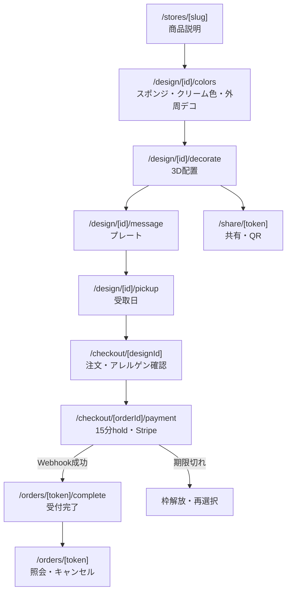
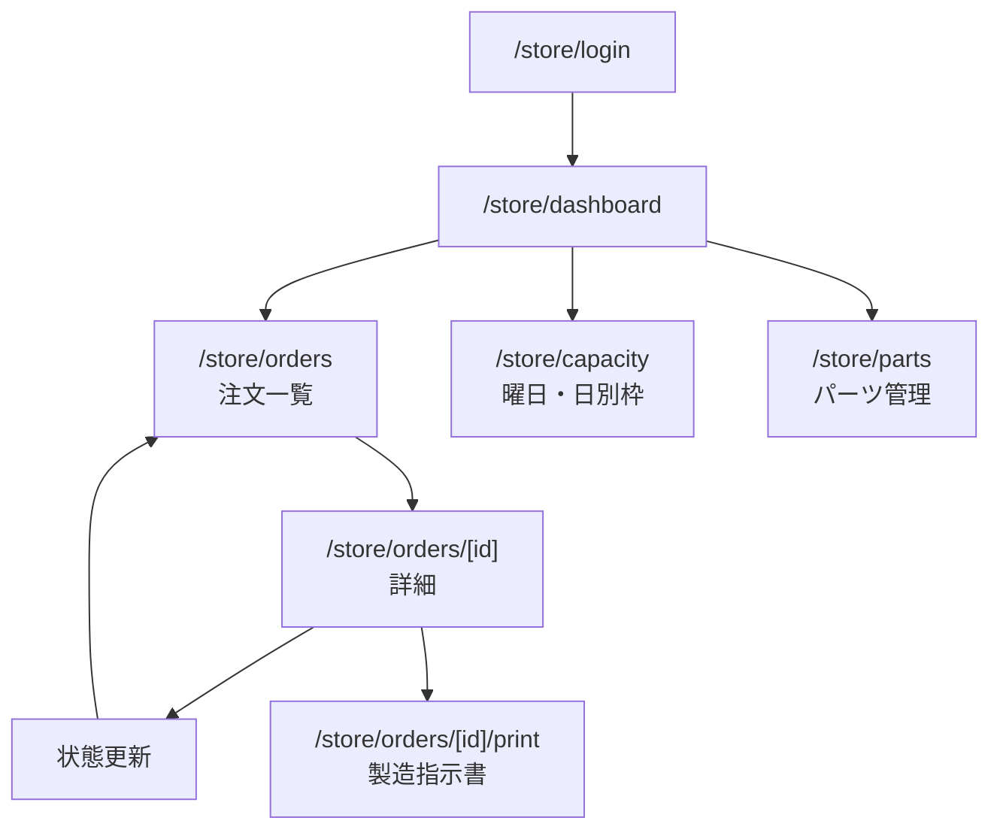
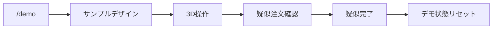

# 画面遷移図

ルート名は実装時の基準案。既存ルーティングと衝突する場合は Issue 内で変更理由を記録する。

## 購入者フロー

購入画面の戻る操作ではデザイン ID を維持する。注文確定後は元デザインを編集せず、再注文は複製から始める。

## 店舗フロー

店舗画面はログイン必須。全クエリをログイン店舗の `store_id` で制限し、別店舗 ID の URL を指定しても閲覧できないようにする。

## デモフロー

デモでは顧客名・メールを収集せず、Stripe・本番容量・本番注文番号を利用しない。

## 代替・エラー経路

| 状況 | 表示・遷移 |
|---|---|
| WebGL / GLB 読込失敗 | SVG 上面図へ切替。再読込ボタンを表示 |
| 保存競合 | 最新デザインを再取得し、再操作を案内 |
| 受取枠売切れ | 選択画面へ戻し、最新空き日を再表示 |
| hold 期限切れ | pending を expired にし、受取日再選択 |
| 決済画面離脱 | hold 期限までは復帰可能。期限後は再取得 |
| Webhook 処理待ち | 「確認中」を表示し、完了ページで安全に再照会 |
| 不正/期限切れトークン | 存在を推測できない共通エラー |
| メール送信失敗 | 完了画面は維持。店舗側で再送可能 |
| オフライン展示 | 静止画・事前録画・説明用サンプルへ切替 |

## 画面責務

| 画面 | 主な入力 | 主な出力・処理 | 関連 Issue |
|---|---|---|---|
| 商品説明 | 店舗 slug | 基本価格、仕様、開始導線 | #35, #37 |
| 色設定 | preset / RGB、外周デコ | design 保存 | #36, #38, #39 |
| 3D配置 | part、座標、回転、拡縮 | placements 保存、SVG 同期 | #40–#45 |
| メッセージ | 文言、プレート有無 | 価格・design 更新 | #36, #39 |
| 受取日 | 日付 | availability、hold | #46, #47 |
| 注文確認 | 顧客情報、確認操作 | スナップショット、allergen確認 | #48 |
| 決済 | PaymentIntent | pending 表示。確定は Webhook | #50, #51 |
| 注文照会 | access token | 状態、キャンセル可否 | #49, #57–#59 |
| 共有 | share token | 個人情報なしのデザイン、QR | #63 |
| 店舗注文一覧 | filters | 店舗内注文一覧 | #52, #53 |
| 店舗注文詳細 | status 操作 | 履歴追加、指示書 | #53, #56 |
| 容量設定 | 曜日・日別値 | capacity 更新 | #55 |
| パーツ管理 | 名称・価格・asset | part 更新 | #54 |
| デモ | サンプル操作 | 非永続または専用データ | #62 |
